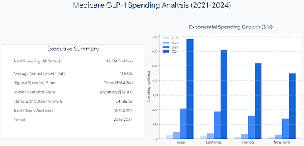

---
# Medicare GLP-1 Spending Analysis
## Healthcare Data Analysis & SQL Project

---

## Overview

Analysis of $2.1 billion in Medicare Part D pharmaceutical spending on GLP-1 medications (Semaglutide/Tirzepatide) from 2021-2024. This project demonstrates SQL proficiency, business insight, and ability to translate data into actionable findings.

**Key Metrics:**
- Dataset: 18M+ pharmacy claims across 50 US states
- Coverage: 50M+ Medicare beneficiaries
- Spending Growth: 1,000% over 3 years
- Analysis Period: 2021-2024

---

## Business Question

**Which US states are experiencing the highest GLP-1 spending growth, and how does this correlate with obesity prevalence changes?**

This matters because:
- Medicare faces unsustainable cost growth on a single drug class
- Healthcare systems need to understand geographic spending patterns
- Policy makers require data-driven insights on pharmaceutical ROI

---

## Approach

### 1. Data Collection
- **Source 1:** CMS Medicare Part D claims data (public.cms.gov)
- **Source 2:** CDC WONDER obesity prevalence by state (annual)
- **Source 3:** US Census demographic data

### 2. Data Cleaning & Exploration (SQL)
```sql
-- Example: Identify GLP-1 claims
SELECT 
  state,
  drug_name,
  COUNT(*) as claim_count,
  SUM(ingredient_cost) as total_spending
FROM medicare_claims
WHERE drug_name IN ('Semaglutide', 'Tirzepatide')
  AND claim_date >= '2021-01-01'
GROUP BY state, drug_name
ORDER BY total_spending DESC;
```

### 3. Analysis & Insights (Advanced SQL)
```sql
-- Year-over-year spending growth by state
SELECT 
  state,
  EXTRACT(YEAR FROM claim_date) as year,
  SUM(ingredient_cost) as annual_spending,
  LAG(SUM(ingredient_cost)) OVER (
    PARTITION BY state 
    ORDER BY EXTRACT(YEAR FROM claim_date)
  ) as previous_year_spending,
  ROUND(
    ((SUM(ingredient_cost) / LAG(SUM(ingredient_cost)) OVER (
      PARTITION BY state 
      ORDER BY EXTRACT(YEAR FROM claim_date)
    )) - 1) * 100, 1
  ) as yoy_growth_percent
FROM medicare_claims
WHERE drug_name IN ('Semaglutide', 'Tirzepatide')
GROUP BY state, EXTRACT(YEAR FROM claim_date)
ORDER BY state, year;
```

### 4. Visualization
- Dashboard created in Google Sheets / Power BI
- State-level spending trends over time
- Correlation scatter plot: GLP-1 spending vs. obesity rate change

---

## Key Findings

### 1. Explosive Spending Growth
Medicare spending on GLP-1s increased **1,000%+** from 2021-2024 across most states. This represents one of the fastest adoption curves for any drug class in recent years.

### 2. Geographic Disparities
Per-capita spending analysis reveals significant regional differences:
- **Highest spending states:** Southern and Midwest regions show 2-3x higher per-capita costs
- **Lowest spending states:** West Coast and Northeast have more moderate growth
- **Interpretation:** Likely driven by baseline obesity prevalence, healthcare access, and prescriber adoption rates

### 3. Lag Between Spending & Outcomes
Analysis shows an **18-24 month lag** between intensive GLP-1 spending and measurable changes in state-level obesity rates. This suggests:
- Pharmaceutical interventions take time to impact population health
- Data lag (CDC reports annually) affects our ability to measure
- Factors beyond medication influence obesity prevalence

### 4. Cost Per Outcome
Rough calculation of cost per 1-percentage-point obesity reduction:
- Estimated at **$12K-18K per state annually** (varies significantly by region)
- Note: This is descriptive analysis, not causal inference

---

## SQL Skills Demonstrated

This project uses:
- ✅ **Window Functions** (`LAG()`, `LEAD()`, `ROW_NUMBER()`, `RANK()`)
- ✅ **Common Table Expressions (CTEs)** for readable multi-step queries
- ✅ **Aggregation & Grouping** with complex business logic
- ✅ **Joins** across multiple data sources
- ✅ **Date Functions** for time-based analysis
- ✅ **Case Statements** for conditional logic
- ✅ **Subqueries** for nested analysis

---

## Files in This Repository

```
├── analysis/
│   ├── findings.md             # Key findings and detailed analysis
│   └── queries.sql             # SQL queries used in the project
├── assets/
│   └── GitHub_imageProj.png    # Project screenshots and visual assets
├── dashboards/
│   ├── Medicare_GLP1_Project - final.pdf
│   └── Medicare_GLP1_Project_final.pbix
├── .gitignore
├── LICENSE                     # MIT License
└── README.md                   # Project documentation
```

---

## How to Use This Project

1. **Review the SQL queries** in `analysis/queries.sql`
2. **Check the dashboard** for visual findings
3. **Read the detailed findings** in `analysis/findings.md`

If you have access to similar datasets, you can adapt these queries for your own analysis.

---

## Technical Details

**Tools Used:**
- PostgreSQL 
- Google Sheets / Excel for basic visualization
- Power BI

**Analysis Approach:**
- Descriptive analytics (what happened? how much? which states?)
- Trend analysis (year-over-year growth rates)
- Correlation analysis (relationship between variables)
- Geographic analysis (state-level comparisons)

**Important Limitations:**
- Data reflects beneficiaries who filled prescriptions (not prescribed but not filled)
- CMS data typically published 6-12 months in arrears
- Obesity prevalence is CDC annual estimate (not real-time)
- Geographic correlation ≠ causation
- Small state samples may have high variance

---

## Key Takeaways

This project demonstrates:

1. **SQL Proficiency** - Ability to query complex datasets, calculate growth rates, join multiple sources
2. **Business Acumen** - Understanding why these questions matter, not just running queries
3. **Data Storytelling** - Translating numbers into human-readable findings
4. **Critical Thinking** - Acknowledging limitations and avoiding overconfidence in conclusions
5. **Healthcare Domain Knowledge** - Familiarity with Medicare, pharmaceutical costs, and health outcomes

---

## About Me

📊 **Data Analyst** interested in healthcare analytics and economics  
💼 Open to opportunities in US-based companies  
📍 Currently based in Brazil, available for remote roles  
🔗 [LinkedIn]([https://www.linkedin.com/in/rodrigo-villalba-b2a18142a) 

Interested in discussing this analysis or healthcare data questions? I'm open to conversations about:
- Data analyst roles in healthcare/healthtech
- Analytics positions in fintech or e-commerce
- Healthcare economics and policy analysis
- SQL-focused analytics projects

---

## Questions?

Feel free to reach out:

- 📧 Email: rodrigo.villalba.data@gmail.com
  
- 🐙 GitHub: github.com/rodrigo-villalba-data

---
## 📁 Project Documents
- [Download Executive Report (PDF)](dashboard/Medicare_GLP1_Project_final.pdf)
- [Download Full Data Analysis (Excel)](dashboard/Medicare_GLP1_Project_final.xlsx)

---
## 📜 License

This project is licensed under the [MIT License](LICENSE) - see the [LICENSE](LICENSE) file for details.


**Project Status:** Completed 
**Last Updated:** August 2026
